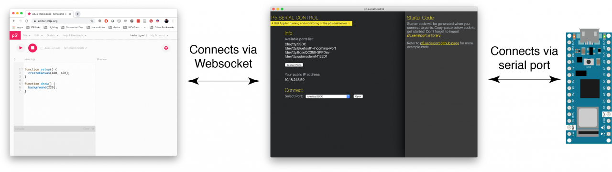

# Perlin Visualization
Visualization of movement using our custom sensor

## What?
This repository contains code needed to receive analog input from a custom sensor to control directional movement of a Perlin noise visualization

## How?
Our custom stretch sensor circuit sends output values through Arduino, via serial port, which is channeled through p5.serialcontrol.app [[2](#p5serial)] to a p5.js sketch. This is illustrated in the diagram below:

Readers may create their own custom sensor circuit using suggestions documented here:

https://www.kobakant.at/DIY/?p=6063

## Example
This video shows a working example, using our custom stretch sensor:

## Play

To play with the demo, just go to this URL:

https://counterchemists.github.io/perlin/

Pressing backspace will toggle black/white, but there are other key controls hidden in the code ;)

## References
### Generative Gestaltung
[Creative Coding im Web](http://www.generative-gestaltung.de/) for Perlin noise starter code
### p5serial
 [NYU ITP Physical Computing Lab](https://itp.nyu.edu/physcomp/labs/labs-serial-communication/lab-serial-input-to-the-p5-js-ide/) for resources related to p5 Serial Control
